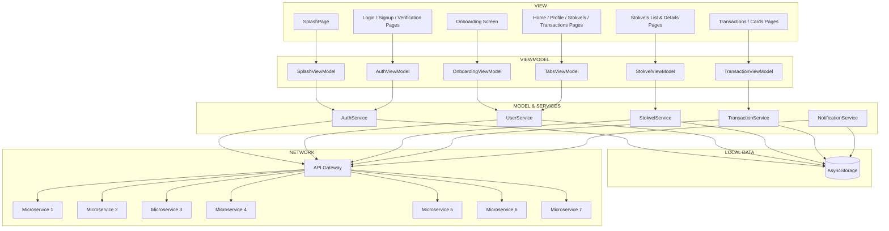

## Getting Started

### Prerequisites

- **Node.js**: v18 or later ([Download](https://nodejs.org/)).
- **Git**: For cloning the repository.
- **Expo CLI**: For managing the mobile app.
- **Expo Go App**: For testing on iOS/Android devices.
- **Emulator/Simulator**: Android Studio (Android) or Xcode (iOS, macOS only).
- **Editor**: VS Code with ESLint, Prettier, and TypeScript extensions.
- **Terminal**: PowerShell (Windows), Terminal (macOS), or equivalent (Linux).

### Stokfellow's MVVM Client Architecture



### Setup Instructions

Follow these steps to set up the StockFellow mobile app on your machine. Commands are provided for PowerShell, but they work in other terminals with slight syntax adjustments (e.g., use `rm -rf` instead of `Remove-Item`).

1. **Clone the Repository**:
   ```powershell
   cd C:\Users\<YourUsername>\Projects
   git clone <repository-url>
   cd stockfellow
   ```
   - Replace `<repository-url>` with your GitHub repo URL (e.g., `https://github.com/your-team/stockfellow.git`).

2. **Install Node.js**:
   - Verify: `node --version` (should show v18.x.x).
   - If not installed, download from [nodejs.org](https://nodejs.org/) or use:
     ```powershell
     nvm install 18
     nvm use 18
     ```


3. **Initial Installation Project Dependencies**:
   ```powershell
   npm install
   ```
   - Installs dependencies for all workspaces (`apps/`, `services/`, `packages/`), hoisting shared packages to the root `node_modules/`.

3. **If You want to install a new package for the mobile app**:
   ```powershell
   cd apps/mobile-app
   npm install <package-name>
   ```


7. **Start the Mobile App**:
   ```powershell
   cd apps/mobile-app
   npx expo start --clear
   ```
   -Or from the root folder
   ```powershell
   npm run start --workspace=mobile-app
   ```
   - The `--clear` flag resets the Metro cache.
   - Test with:
     - **Expo Go**: Scan the QR code on an iOS/Android device.
     - **Emulator**: Press `a` (Android Studio) or `i` (Xcode, macOS only).
   - If connection issues occur, use:
     ```powershell
     npx expo start --tunnel
     ```

8. **Run Tests**:
   ```powershell
   npm test --workspace=apps/mobile-app
   npm run test:cypress --workspace=apps/mobile-app
   ```
   - Ensures Jest (unit) and Cypress (end-to-end) tests pass, aligning with N6.3 (Automated testing).
   - To execute the integration tests:

  ```powershell
  npm run test:integration
  ```
  - To run in watch mode:

  ```powershell
  npm run test:integration:watch
  ```
  - To generate coverage reports:

  ```powershell
  npm run test:integration:coverage
  ```

9. **Git Workflow**:
   - Create a feature branch:
     ```powershell
     git checkout -b feature/<your-name>/<feature-name>
     ```
     Example: `git checkout -b feature/tinotenda/login-screen`
   - Commit and push:
     ```powershell
     git add .
     git commit -m "Add login screen"
     git push origin feature/<your-name>/<feature-name>
     ```
   - Create a pull request on GitHub for review.

## Troubleshooting

- **Expo Go Connection**:
  - Ensure device and computer are on the same Wi-Fi or use `--tunnel`.
- **Node.js Version**:
  - Verify: `node --version`. Use `nvm use 18` if incorrect.
- **Slow Metro**:
  - The provided `metro.config.js` optimizes monorepo performance.

## Resources

- [Expo Documentation](https://docs.expo.dev/)
- [React Native Documentation](https://reactnative.dev/)
- [npm Workspaces](https://docs.npmjs.com/cli/v7/using-npm/workspaces/)
- [GitHub Actions](https://docs.github.com/en/actions)
- [AWS Free Tier](https://aws.amazon.com/free/)
- [React Native Paper](https://callstack.github.io/react-native-paper/)


## License

0BSD (see `apps/mobile-app/package.json`).