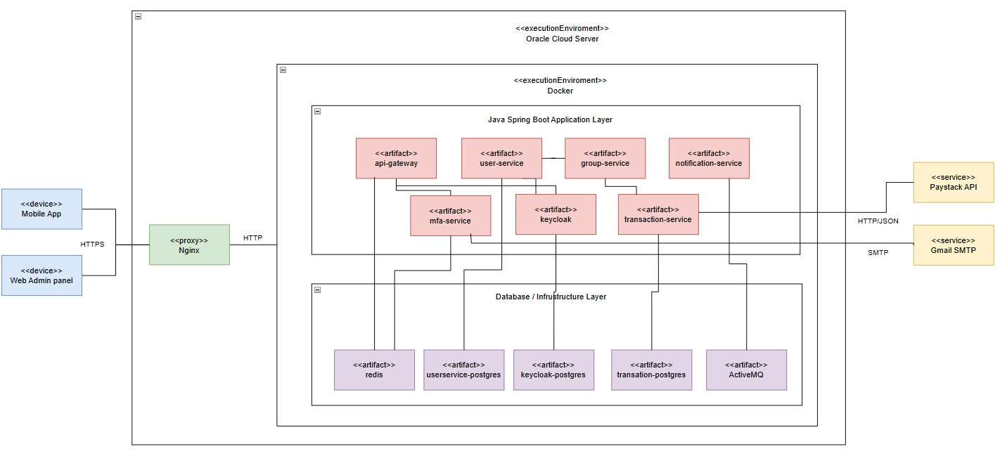

# StockFellow System Deployment Model

The StockFellow fintech backend will be deployed as a containerized Java Spring Boot microservices architecture on Oracle Cloud's free tier ARM compute instance. The system uses Docker Compose for orchestration and is cost-effective with very capable hardware.

## 1. Deployment Environment

### 1.1 Target Platform
- **Cloud Provider**: Oracle Cloud Infrastructure (OCI)
- **Instance Type**: ARM-based Ampere A1 Compute (Always Free)
- **Specifications**: 24GB RAM, 4 OCPUs, 200GB Storage
- **Operating System**: Ubuntu 22.04 LTS
- **Container Runtime**: Docker with Docker Compose

### 1.2 Reasons For Oracle Selection
- **Low/No cost** with generous Always Free services
- **Sufficient resources** for all microservices and databases
- **ARM architecture** provides excellent performance per core

## 2. Backend Deployment Diagram


## 3. Architecture Overview

### 3.1 Deployment Pattern
The system implements a **single-server containerized microservices architecture** with:
- **NGINX Reverse Proxy**: SSL termination and load balancing
- **Java Spring Boot Services**: Business logic microservices
- **PostgreSQL Databases**: Relational data storage
- **Redis Cache**: Session management and caching

### 3.2 Service Architecture

#### **Client Access Layer**
- **Mobile Apps**: React Native/Flutter applications
- **Web Admin Panel**: Browser-based administration
- **External Access**: HTTPS through domain name or public IP

#### **Proxy Layer**
- **NGINX**: Port 80/443 (SSL termination, reverse proxy)

#### **Application Layer (Java Spring Boot)**
- **API Gateway**: Port 3000 (Request routing, authentication)
- **User Service**: Port 4000 (User management, profiles)
- **Group Service**: Port 4040 (Investment groups, communities)
- **Transaction Service**: Port 4080 (Payment processing, Paystack integration)
- **MFA Service**: Port 8087 (Multi-factor authentication)
- **Notification Service**: Port 4050 (Push notifications, messaging)
- **Keycloak**: Port 8180 (Identity and access management)

#### **Database Layer**
- **Keycloak PostgreSQL**: Port 5432 (Identity data)
- **User Service PostgreSQL**: Port 5431 (User profiles, accounts)
- **Notification PostgreSQL**: Port 5440 (Notification history)
- **Redis Cache**: Port 6379 (Sessions, cache)
- **ActiveMQ**: Port 61616 (Message broker)

#### **External Services**
- **Gmail SMTP**: Email delivery for MFA
- **Paystack API**: Payment processing

## 4. Container Architecture

### 4.1 Application Containers

| Service | Technology | Port | Purpose |
|---------|------------|------|---------|
| nginx-proxy | NGINX | 80, 443 | Reverse proxy, SSL termination |
| api-gateway | Spring Boot | 3000 | API routing, authentication |
| user-service | Spring Boot | 4000 | User management |
| group-service | Spring Boot | 4040 | Group operations |
| transaction-service | Spring Boot | 4080 | Payment processing |
| mfa-service | Spring Boot | 8087 | Multi-factor authentication |
| notification-service | Spring Boot | 4050 | Notifications |
| keycloak | Keycloak | 8080 | Identity management |

### 4.2 Database Containers

| Service | Technology | Port | Purpose |
|---------|------------|------|---------|
| keycloak-postgres | PostgreSQL 15 | 5432 | Keycloak data |
| user-service-postgres | PostgreSQL 15 | 5431 | User data |
| notification-postgres | PostgreSQL 15 | 5440 | Notification data |
| redis | Redis 7 | 6379 | Cache and sessions |
| activemq | ActiveMQ Artemis | 61616 | Message brokering |

## 5. Network Architecture

### 5.1 Security Model
- **External Access**: Only NGINX (ports 80, 443) exposed to internet
- **Internal Network**: All services communicate via Docker bridge network
- **SSL/TLS**: NGINX handles SSL termination
- **Authentication**: JWT tokens via Keycloak for all API access

### 5.2 Communication Flow
```
Mobile App → NGINX (HTTPS) → API Gateway → Keycloak (Auth) → Microservices
                                      ↓
                              Redis Cache + PostgreSQL DBs           
```

## 6. Deployment Process

### 6.1 Prerequisites
1. Oracle Cloud ARM compute instance (24GB RAM)
2. Domain name pointing to public IP (optional)
3. Gmail account with app password for SMTP

### 6.2 Deployment Steps
```bash
# 1. Setup server environment
./deploy.sh

# 2. Transfer project files
scp -r stockfellow-project ubuntu@server-ip:/home/ubuntu/stockfellow/

# 3. Configure environment
cp .env.production .env
# Edit .env with production values

# 4. Deploy services
docker-compose -f docker-compose.prod.yml up -d

# 5. Validate deployment
./validate.sh
```

### 6.3 Configuration Management
- **Environment Variables**: All configuration via .env file
- **Secrets**: Database passwords, API keys in environment variables
- **External URLs**: Domain-based URLs for production
- **JVM Settings**: Optimized for 24GB RAM allocation

## 7. Resource Allocation

### 7.1 Memory Distribution (24GB Total)
- **Java Services**: 10GB (6 services × ~1.5GB each)
- **Keycloak**: 2GB
- **PostgreSQL**: 1.5GB (3 instances)
- **Redis + ActiveMQ**: 0.5GB
- **NGINX**: 0.1GB
- **System/OS**: 6GB
- **Buffer**: 4GB

### 7.2 JVM Optimization
```bash
JVM_OPTS=-Xms512m -Xmx1.5g -XX:+UseG1GC -XX:MaxGCPauseMillis=200
```

## 8. Data Management

### 8.1 Database Strategy
- **PostgreSQL**: ACID-compliant relational data
- **Redis**: Session storage and caching
- **Persistent Volumes**: All data stored in Docker volumes

### 8.2 Backup Strategy
- **Automated Backups**: Daily PostgreSQL dumps
- **Configuration**: Version controlled in Git

## 9. Monitoring and Maintenance

### 9.1 Health Monitoring
- **Health Endpoints**: All Spring Boot services expose `/actuator/health`
- **Database Health**: `pg_isready` for PostgreSQL instances
- **System Monitoring**: `monitor.sh` script for resource usage

### 9.2 Logging
- **Application Logs**: Docker container logs
- **Access Logs**: NGINX request logging
- **Error Tracking**: Centralized via Docker logs

## 10. Security Considerations

### 10.1 Network Security
- **Firewall**: Only ports 22, 80, 443 open to internet
- **Internal Communication**: Services isolated in Docker network
- **SSL/TLS**: All external communication encrypted

### 10.2 Application Security
- **OAuth 2.0**: Authentication via Keycloak
- **JWT Tokens**: Secure service-to-service communication
- **Database Security**: Isolated databases per service
- **Secret Management**: Environment variable based
- **Tokenized Payment Details**: via Paystack Authorizations